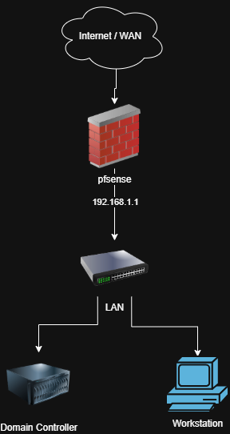

# SOC Home Lab

A self-built Security Operations Center (SOC) home lab, created to gain hands-on experience with network security, firewall configuration, endpoint monitoring, and threat detection tools. Built as part of the "Building a SOC Home Lab" course by LetsDefend, with my own configuration decisions, troubleshooting, and notes added throughout.

## Why I Built This

I wanted practical, hands-on experience with the tools and architecture used in real SOC environments — not just theory. This lab simulates a small enterprise network (firewall, domain controller, workstation, and monitoring/detection tools) so I could practice configuring, securing, and monitoring it end-to-end.

## Tools & Technologies Used

- **Oracle VirtualBox** — virtualization platform hosting all VMs
- **pfSense (Netgate CE)** — firewall / router, network segmentation
- **Active Directory** — domain services *(in progress)*
- **Windows Workstation** — client endpoint *(in progress)*
- **Sysmon** — endpoint logging and telemetry *(in progress)*
- **CrowdSec** — intrusion detection / threat response *(in progress)*

## Network Architecture

```

```

**Planned network layout:**
- **WAN** interface (em0) — DHCP, simulates internet-facing connection
- **LAN** interface (em1) — static IP `192.168.1.1/24`, internal network for domain controller and workstation
- **OPT1** interface (em2) — reserved for future segmentation (e.g. isolated monitoring segment)

## Build Log

### 1. pfSense Installation & Firewall Setup

**What I did:**
- Created a VM in VirtualBox and mounted the pfSense (Netgate CE) installer ISO
- Ran through the guided installer to install pfSense onto a 20GB virtual disk
- Assigned virtual network interfaces: WAN → em0, LAN → em1, OPT1 → em2
- Configured the LAN interface with a static IP:
  - IPv4 address: `192.168.1.1`
  - Subnet: `/24` (255.255.255.0)
  - Gateway: `none` (LAN interfaces don't need an upstream gateway)
  - IPv6: disabled
- Disabled the DHCP server on LAN (to be configured later once client VMs are added)
- Kept the web configurator on **HTTPS** (default, more secure than reverting to HTTP)

**Problems I ran into & how I solved them:**
- **Boot failure on first launch:** VirtualBox reported it couldn't find the ISO file. Cause: the pfSense download was a compressed `.iso.gz` file that hadn't been extracted. Fixed by extracting it with 7-Zip and pointing VirtualBox at the resulting `.iso`.
- **"Installation has failed" error mid-install:** The Netgate installer threw an error and pointed to `/tmp/install-log.txt`. Investigated the log via the installer's shell (`cat /tmp/install-log.txt`) and found the run had actually completed successfully on a later attempt — an earlier failed pass had been logged, but the final log entries confirmed "pfSense Post Installation setup .. done."
- **VM re-booting into the installer instead of the installed system:** After a successful install, the VM kept re-launching the installer on reboot. Cause: the installer ISO was still attached to the virtual optical drive. Fixed by ejecting it via VirtualBox Settings → Storage → removing the disk from the IDE controller before restarting the VM.

### 2. Active Directory
*(To be added)*

### 3. Windows Workstation
*(To be added)*

### 4. Sysmon
*(To be added)*

### 5. CrowdSec
*(To be added)*

## Screenshots

```

```

## What I Learned

- How to install and perform initial configuration of pfSense as a virtual firewall/router
- Troubleshooting common VirtualBox/ISO mounting and boot-order issues
- Reading and interpreting installer logs to diagnose failed installs
- Basic network interface assignment and static IP configuration on a firewall appliance
- *(Keep adding as you progress through AD, Sysmon, CrowdSec, etc.)*

## About

Course followed: *Building a SOC Home Lab* by LetsDefend (prepared by Julien Garcia).
Lab built and documented independently as a personal learning/portfolio project.
